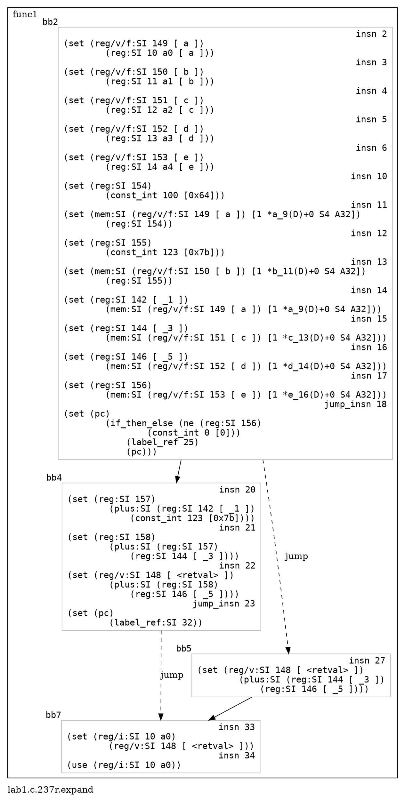

# rtl2dot

> The Python code may be ugly, because I am new to Python. If you like to refactor it, feel free to do it.

### Usage

```shell
gcc lab1.c -O3 -fdump-rtl-all
python3 rtl2dot.py lab1.c.237r.expand -o lab1.c.237r.dot
```

The output lab1.c.237r.dot file which can be copy to http://magjac.com/graphviz-visual-editor/ to preview or use [`dot`](https://graphviz.org/doc/info/command.html) program `dot -Tpng lab1.c.237r.dot > lab1.c.237r.png`

#### preview


#### lab1.c

```c
int func1(int* a, int* b, int* c, int* d, int* restrict e)
{       
        *a = 100;
        *b = 123;
        int sum = *a + *b + *c + *d;
        if (*e) {
                return *c + *d;
        } else {
                return sum;
        }
}
```

#### lab1.c.237r.expand

```

;; Function func1 (func1, funcdef_no=3, decl_uid=24208, cgraph_uid=4, symbol_order=3)


;; Generating RTL for gimple basic block 2

;; Generating RTL for gimple basic block 3

;; Generating RTL for gimple basic block 4

;; Generating RTL for gimple basic block 5


try_optimize_cfg iteration 1

Merging block 3 into block 2...
Merged blocks 2 and 3.
Merged 2 and 3 without moving.
Redirecting jump 23 from 6 to 7.
Merging block 6 into block 5...
Merged blocks 5 and 6.
Merged 5 and 6 without moving.
Removing jump 30.


try_optimize_cfg iteration 2


;;
;; Full RTL generated for this function:
;;
(note 1 0 8 NOTE_INSN_DELETED)
(note 8 1 2 2 [bb 2] NOTE_INSN_BASIC_BLOCK)
(insn 2 8 3 2 (set (reg/v/f:SI 149 [ a ])
        (reg:SI 10 a0 [ a ])) "lab1.c":7:1 -1
     (nil))
(insn 3 2 4 2 (set (reg/v/f:SI 150 [ b ])
        (reg:SI 11 a1 [ b ])) "lab1.c":7:1 -1
     (nil))
(insn 4 3 5 2 (set (reg/v/f:SI 151 [ c ])
        (reg:SI 12 a2 [ c ])) "lab1.c":7:1 -1
     (nil))
(insn 5 4 6 2 (set (reg/v/f:SI 152 [ d ])
        (reg:SI 13 a3 [ d ])) "lab1.c":7:1 -1
     (nil))
(insn 6 5 7 2 (set (reg/v/f:SI 153 [ e ])
        (reg:SI 14 a4 [ e ])) "lab1.c":7:1 -1
     (nil))
(note 7 6 10 2 NOTE_INSN_FUNCTION_BEG)
(insn 10 7 11 2 (set (reg:SI 154)
        (const_int 100 [0x64])) "lab1.c":8:12 -1
     (nil))
(insn 11 10 12 2 (set (mem:SI (reg/v/f:SI 149 [ a ]) [1 *a_9(D)+0 S4 A32])
        (reg:SI 154)) "lab1.c":8:12 -1
     (nil))
(insn 12 11 13 2 (set (reg:SI 155)
        (const_int 123 [0x7b])) "lab1.c":9:12 -1
     (nil))
(insn 13 12 14 2 (set (mem:SI (reg/v/f:SI 150 [ b ]) [1 *b_11(D)+0 S4 A32])
        (reg:SI 155)) "lab1.c":9:12 -1
     (nil))
(insn 14 13 15 2 (set (reg:SI 142 [ _1 ])
        (mem:SI (reg/v/f:SI 149 [ a ]) [1 *a_9(D)+0 S4 A32])) "lab1.c":10:19 -1
     (nil))
(insn 15 14 16 2 (set (reg:SI 144 [ _3 ])
        (mem:SI (reg/v/f:SI 151 [ c ]) [1 *c_13(D)+0 S4 A32])) "lab1.c":10:29 -1
     (nil))
(insn 16 15 17 2 (set (reg:SI 146 [ _5 ])
        (mem:SI (reg/v/f:SI 152 [ d ]) [1 *d_14(D)+0 S4 A32])) "lab1.c":10:34 -1
     (nil))
(insn 17 16 18 2 (set (reg:SI 156)
        (mem:SI (reg/v/f:SI 153 [ e ]) [1 *e_16(D)+0 S4 A32])) "lab1.c":11:12 -1
     (nil))
(jump_insn 18 17 19 2 (set (pc)
        (if_then_else (ne (reg:SI 156)
                (const_int 0 [0]))
            (label_ref 25)
            (pc))) "lab1.c":11:12 -1
     (int_list:REG_BR_PROB 536870916 (nil))
 -> 25)
(note 19 18 20 4 [bb 4] NOTE_INSN_BASIC_BLOCK)
(insn 20 19 21 4 (set (reg:SI 157)
        (plus:SI (reg:SI 142 [ _1 ])
            (const_int 123 [0x7b]))) "lab1.c":10:22 -1
     (nil))
(insn 21 20 22 4 (set (reg:SI 158)
        (plus:SI (reg:SI 157)
            (reg:SI 144 [ _3 ]))) "lab1.c":10:27 -1
     (nil))
(insn 22 21 23 4 (set (reg/v:SI 148 [ <retval> ])
        (plus:SI (reg:SI 158)
            (reg:SI 146 [ _5 ]))) "lab1.c":10:13 -1
     (nil))
(jump_insn 23 22 24 4 (set (pc)
        (label_ref:SI 32)) "lab1.c":10:13 239 {jump}
     (nil)
 -> 32)
(barrier 24 23 25)
(code_label 25 24 26 5 2 (nil) [1 uses])
(note 26 25 27 5 [bb 5] NOTE_INSN_BASIC_BLOCK)
(insn 27 26 32 5 (set (reg/v:SI 148 [ <retval> ])
        (plus:SI (reg:SI 144 [ _3 ])
            (reg:SI 146 [ _5 ]))) "lab1.c":12:27 -1
     (nil))
(code_label 32 27 35 7 1 (nil) [1 uses])
(note 35 32 33 7 [bb 7] NOTE_INSN_BASIC_BLOCK)
(insn 33 35 34 7 (set (reg/i:SI 10 a0)
        (reg/v:SI 148 [ <retval> ])) "lab1.c":16:1 -1
     (nil))
(insn 34 33 0 7 (use (reg/i:SI 10 a0)) "lab1.c":16:1 -1
     (nil))
```

#### lab1.c.237r.dot


